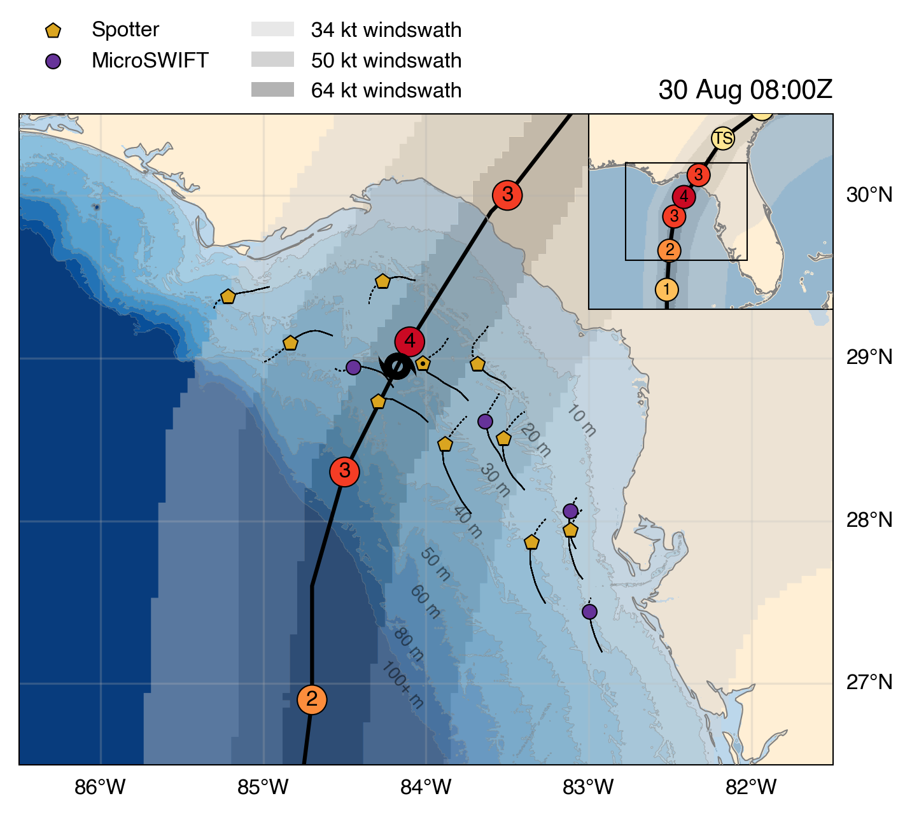

[](https://doi.org/10.5281/zenodo.13953570)

# Code for:

J. Davis, J. Thomson, I. Houghton, C. Fairall, B. Butterworth, E. Thompson, G. de Boer, J. Doyle, and J. Moskaitis (2024) "Ocean surface wave slopes and wind-wave alignment observed in Hurricane Idalia" submitted to JGR Oceans.




## Abstract
Drifting buoy observations in Hurricane Idalia (2023) are used to investigate the dependence of ocean surface wave mean square slope on wind, wave, and storm characteristics.
Mean square slope has a primary dependence on wind speed that is linear at low-to-moderate wind speeds and approaches saturation at high wind speeds ($>$ 20 m/s).
Inside Hurricane Idalia, buoy-measured mean square slopes have a secondary dependence on wind-wave alignment:
at a given wind speed, slopes are higher where wind and waves are aligned compared to where wind and waves are crossing.
At moderate wind speeds, differences in mean square slope between aligned and crossing conditions can vary 15\% to 20\% relative to their mean.
These changes in wave slopes may be related to the reported dependence of air-sea drag coefficients on wind-wave alignment.

### Plain Language Summary
Wave slope, or the ratio of a wave's height to its length, is explored in connection to wind and wave characteristics within Hurricane Idalia (2023).
Slopes primarily depend on wind speed: waves steepen quickly in low-to-moderate wind conditions, but this rate of increase drops drastically at the high wind speeds found in hurricanes.
At a given wind speed, buoy data from  Hurricane Idalia reveal a dependence of slope on the relative alignment of the wind and wave directions. 
Slopes are elevated when the wind blows in the same direction the waves travel and are reduced when the wind blows roughly perpendicular to the waves.
Wave slope, particularly of the shorter waves, is related to the roughness of the ocean surface, which is critical to modeling wind surface forcing (or ``drag'') in hurricanes.
Understanding variations in slope within hurricanes thus helps to inform the prediction models used for hurricane intensity and coastal flooding forecasts. 

## Data

All data are available in the Dryad repository for this publication (https://doi.org/10.5061/dryad.zw3r228h7) and in the Dryad repository for Davis et al. (2023) (https://doi.org/10.5061/dryad.g4f4qrfvb). 

Input data should be saved in [input_data/](input_data/), and paths are saved in [config.toml](config.toml).  See [input_data/README.md](input_data/README.md).  

## Structure

Analysis is organized into 11 Jupyter notebooks (.ipynb).  Notebooks are named in the order they should be run (e.g. nb0, nb1, ..., nb10).  Variables are shared between notebooks, and notebooks call prior notebooks as needed.

Most functions are organized into modules within [src/](src/).  Much of the code is from a standalone package, but it is copied here for archival purposes.

## Installation

1. Clone this repository.  In the terminal, run:
   ```sh
   git clone https://github.com/jacobrdavis/ocean-surface-wave-slopes-and-wind-wave-alignment-observed-in-hurricane-idalia.git
   ```
3. Download the data and move it to [input_data/](input_data/). (See the **Data** section above.)
4. Create a Python environment.  If using conda, run:
   ```sh
   conda env create -f environment.yml
   ```
5. Run any of the .ipynb notebooks.
